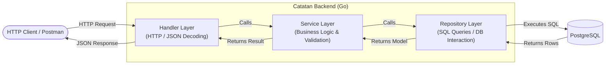

<div align="center">

# 📝 Catatan Backend API

A clean, modular RESTful API for note and category management built with **Go (Golang)** and **PostgreSQL**.

[](https://golang.org/)
[](https://www.postgresql.org/)
[](#-architecture)
[](LICENSE)

</div>

---

## 📌 Table of Contents

- [Overview](#-overview)
- [Architecture](#-architecture)
- [Tech Stack](#-tech-stack)
- [Database Schema](#-database-schema)
- [Folder Structure](#-folder-structure)
- [Getting Started](#-getting-started)
  - [Prerequisites](#prerequisites)
  - [Installation & Setup](#installation--setup)
  - [Environment Variables](#environment-variables)
- [API Documentation](#-api-documentation)
  - [Category Endpoints](#category-endpoints)
  - [Note Endpoints](#note-endpoints)
- [License](#-license)

---

## 🌟 Overview

**Catatan Backend API** is a lightweight yet robust backend service developed to organize notes categorized under dynamic topics. Built following the **Handler-Service-Repository** layered pattern, it emphasizes separation of concerns, maintainability, and clean Go idiomatic practices using modern Go standard routing (`net/http` enhanced routing with path parameters).

### Key Features
- 📂 **Category CRUD**: Organize notes into flexible categories.
- 📝 **Note CRUD**: Complete note lifecycle management with relational category mapping.
- 🔗 **Relational Data**: Seamless SQL `LEFT JOIN` retrieval showing category details within note responses.
- ⚡ **Lightweight & Fast**: Built without heavy external web frameworks, relying on Go 1.22+ native routing (`net/http`).
- 🛡️ **Connection Pooling**: Optimized PostgreSQL connection management (`MaxOpenConns`, `MaxIdleConns`, `ConnMaxLifetime`).

---

## 🏗 Architecture

The project strictly follows the **Layered Architecture** pattern to ensure modularity and ease of testing:



- **Handler (`/handler`)**: Handles HTTP requests, decodes request bodies, validates route parameters (`r.PathValue`), and sends JSON responses with proper HTTP status codes.
- **Service (`/service`)**: Implements business rules and input validations (e.g., verifying empty inputs).
- **Repository (`/repository`)**: Direct database access layer executing raw SQL queries via `database/sql`.
- **Model (`/model`)**: Defines Go data structures and JSON mappings for database entities.

---

## 🛠 Tech Stack

- **Language:** [Go (Golang)](https://go.dev/) (v1.22+)
- **Database:** [PostgreSQL](https://www.postgresql.org/)
- **Database Driver:** [`github.com/lib/pq`](https://github.com/lib/pq)
- **Environment Management:** [`github.com/joho/godotenv`](https://github.com/joho/godotenv)
- **HTTP Routing:** Go Standard Library `net/http` (Go 1.22+ pattern matching)

---

## 🗄 Database Schema

Before running the application, prepare your PostgreSQL database with the following DDL script:

```sql
-- Create categories table
CREATE TABLE IF NOT EXISTS categories (
    id SERIAL PRIMARY KEY,
    name VARCHAR(255) NOT NULL
);

-- Create notes table
CREATE TABLE IF NOT EXISTS notes (
    id SERIAL PRIMARY KEY,
    category_id INT REFERENCES categories(id) ON DELETE SET NULL,
    title VARCHAR(255) NOT NULL,
    content TEXT
);
```

---

## 📁 Folder Structure

```text
.
├── handler/                # HTTP request handlers & presentation logic
│   ├── category_handler.go
│   └── note_handler.go
├── model/                  # Data structures and entities
│   ├── category.go
│   └── note.go
├── repository/             # Data access layer & SQL operations
│   ├── category_repository.go
│   └── note_repository.go
├── service/                # Business logic & validations
│   ├── category_service.go
│   └── note_service.go
├── .env.example            # Environment variables template
├── .gitignore              # Git ignore rules
├── go.mod                  # Go module definition
├── go.sum                  # Go checksums
├── main.go                 # App entry point, DB connection & route mappings
└── README.md               # Project documentation
```

---

## 🚀 Getting Started

### Prerequisites

Ensure you have installed:
- [Go](https://go.dev/dl/) (version 1.22 or higher recommended)
- [PostgreSQL](https://www.postgresql.org/download/)
- Git

### Installation & Setup

1. **Clone the repository:**
   ```bash
   git clone https://github.com/Daneartorious/catatan-gucc.git
   cd catatan-gucc
   ```

2. **Install Go dependencies:**
   ```bash
   go mod download
   ```

3. **Configure Environment Variables:**
   Copy the `.env.example` file to `.env`:
   ```bash
   cp .env.example .env
   ```

4. **Update `.env` with your PostgreSQL credentials:**
   ```env
   DB_HOST=localhost
   DB_PORT=5432
   DB_USER=postgres
   DB_PASSWORD=your_postgres_password
   DB_NAME=tugas_catatan
   ```

5. **Initialize Database Tables:**
   Execute the [Database Schema](#-database-schema) script inside your PostgreSQL database (`tugas_catatan`).

6. **Run the Application:**
   ```bash
   go run main.go
   ```

   The server will start listening on:
   ```text
   Berhasil konek ke PostgreSQL!
   Server jalan di http://localhost:8088
   ```

---

## 📡 API Documentation

Base URL: `http://localhost:8088`

### Category Endpoints

| Method | Endpoint | Description | Status Code |
| :--- | :--- | :--- | :--- |
| `POST` | `/categories` | Create a new category | `201 Created` |
| `GET` | `/categories` | Retrieve all categories | `200 OK` |
| `GET` | `/categories/{id}` | Retrieve a category by ID | `200 OK` |
| `PUT` | `/categories/{id}` | Update an existing category | `200 OK` |
| `DELETE` | `/categories/{id}` | Delete a category | `200 OK` |

#### Category Request & Response Examples

<details>
<summary><b>1. Create Category (`POST /categories`)</b></summary>

**Request Body:**
```json
{
  "name": "Work"
}
```

**Response (`201 Created`):**
```json
{
  "id": 1,
  "name": "Work"
}
```
</details>

<details>
<summary><b>2. Get All Categories (`GET /categories`)</b></summary>

**Response (`200 OK`):**
```json
[
  {
    "id": 1,
    "name": "Work"
  },
  {
    "id": 2,
    "name": "Personal"
  }
]
```
</details>

<details>
<summary><b>3. Get Category by ID (`GET /categories/{id}`)</b></summary>

**Response (`200 OK`):**
```json
{
  "id": 1,
  "name": "Work"
}
```
</details>

<details>
<summary><b>4. Update Category (`PUT /categories/{id}`)</b></summary>

**Request Body:**
```json
{
  "name": "Career & Work"
}
```

**Response (`200 OK`):**
```json
{
  "id": 1,
  "name": "Career & Work"
}
```
</details>

<details>
<summary><b>5. Delete Category (`DELETE /categories/{id}`)</b></summary>

**Response (`200 OK`):**
```json
{
  "message": "Category berhasil dihapus"
}
```
</details>

---

### Note Endpoints

| Method | Endpoint | Description | Status Code |
| :--- | :--- | :--- | :--- |
| `POST` | `/notes` | Create a new note | `201 Created` |
| `GET` | `/notes` | Retrieve all notes (with category name) | `200 OK` |
| `GET` | `/notes/{id}` | Retrieve a note by ID | `200 OK` |
| `PUT` | `/notes/{id}` | Update an existing note | `200 OK` |
| `DELETE` | `/notes/{id}` | Delete a note | `200 OK` |

#### Note Request & Response Examples

<details>
<summary><b>1. Create Note (`POST /notes`)</b></summary>

**Request Body:**
```json
{
  "category_id": 1,
  "title": "Meeting Agenda",
  "content": "Discuss sprint 4 backlog and upcoming milestones."
}
```

**Response (`201 Created`):**
```json
{
  "id": 1,
  "category_id": 1,
  "title": "Meeting Agenda",
  "content": "Discuss sprint 4 backlog and upcoming milestones.",
  "category_name": null
}
```
</details>

<details>
<summary><b>2. Get All Notes (`GET /notes`)</b></summary>

**Response (`200 OK`):**
```json
[
  {
    "id": 1,
    "category_id": 1,
    "title": "Meeting Agenda",
    "content": "Discuss sprint 4 backlog and upcoming milestones.",
    "category_name": "Career & Work"
  }
]
```
</details>

<details>
<summary><b>3. Get Note by ID (`GET /notes/{id}`)</b></summary>

**Response (`200 OK`):**
```json
{
  "id": 1,
  "category_id": 1,
  "title": "Meeting Agenda",
  "content": "Discuss sprint 4 backlog and upcoming milestones.",
  "category_name": "Career & Work"
}
```
</details>

<details>
<summary><b>4. Update Note (`PUT /notes/{id}`)</b></summary>

**Request Body:**
```json
{
  "category_id": 1,
  "title": "Updated Meeting Agenda",
  "content": "Sprint 4 review finalized. Milestones adjusted."
}
```

**Response (`200 OK`):**
```json
{
  "id": 1,
  "category_id": 1,
  "title": "Updated Meeting Agenda",
  "content": "Sprint 4 review finalized. Milestones adjusted.",
  "category_name": null
}
```
</details>

<details>
<summary><b>5. Delete Note (`DELETE /notes/{id}`)</b></summary>

**Response (`200 OK`):**
```json
{
  "message": "Note berhasil dihapus"
}
```
</details>

---

## ⚡ Connection Pooling Optimization

The database connection is tuned using Go's built-in `sql.DB` connection pool configurations in `main.go`:

```go
db.SetMaxOpenConns(25)                 // Maximum number of open connections to the database
db.SetMaxIdleConns(25)                 // Maximum number of idle connections in the pool
db.SetConnMaxLifetime(5 * time.Minute) // Maximum amount of time a connection may be reused
```

---

## 📄 License

This project is open-source and available under the [MIT License](LICENSE).
